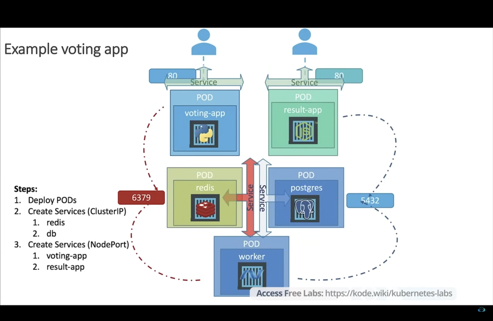

# Kubernetes Voting App Deployment

This project was completed as part of a hands-on learning experience provided by [KodeKloud](https://kode.wiki/kubernetes-labs). The goal was to deploy a multi-tier voting application using Kubernetes. The application consists of multiple services including a frontend voting app, a results display app, Redis for message queuing, PostgreSQL for data persistence, and a background worker to process votes.

---

## Application Architecture Diagram



## Application Components

The application is made up of the following components:

- **voting-app**: Python-based frontend to submit votes.
- **result-app**: Node.js-based frontend to display the results.
- **redis**: In-memory data structure store for temporary vote storage.
- **postgres**: Relational database to store votes persistently.
- **worker**: Background service to transfer votes from Redis to PostgreSQL.

---

## Files Created

The Kubernetes configuration files are organized as follows:

### Deployments:
- `voting-app-deploy.yaml`
- `result-app-deploy.yaml`
- `redis-deploy.yaml`
- `db-deploy.yaml`
- `worker-app-deploy.yaml`

### Services:
- `voting-app-service.yaml`
- `result-app-service.yaml`
- `redis-service.yaml`
- `db-service.yaml`

---

## Deployment Steps

1. **Create a Kubernetes namespace**:
   ```bash
   kubectl create namespace vote
   ```
2. **Create a Kubernetes deployment object - Voting app**:
   ```bash
   kubectl apply -f voting-app-deploy.yaml -n vote
   ```
3.  **Create a Kubernetes service object - Voting app**:
   ```bash
   kubectl apply -f voting-app-service.yaml -n vote
   ```
4.  **Create a Kubernetes deployment object - Result app**:
   ```bash
   kubectl apply -f result-app-deploy.yaml -n vote
   ```
5. **Create a Kubernetes service object - Result app**:
   ```bash
   kubectl apply -f result-app-service.yaml -n vote
   ```
6. **Create a Kubernetes deployment object - Redis server**:
   ```bash
   kubectl apply -f redis-deploy.yaml -n vote
   ```
7. **Create a Kubernetes service object - Redis server**:
   ```bash
   kubectl apply -f redis-service.yaml -n vote
   ```
8. **Create a Kubernetes deployment object - Postgres server**:
   ```bash
   kubectl apply -f db-deploy.yaml -n vote
   ```
9. **Create a Kubernetes service object - Postgres server**:
   ```bash
   kubectl apply -f db-service.yaml -n vote
   ```
10. **Create a Kubernetes deployment object - Redis server**:
   ```bash
   kubectl apply -f worker-app-deploy.yaml -n vote
   ```

---

## Conclusion
Successfully deployed and configured a microservices-based voting application on Kubernetes using YAML configuration files. This project reinforced understanding of core Kubernetes concepts such as pods, deployments, services (ClusterIP & NodePort), namespaces, and inter-service communication.


